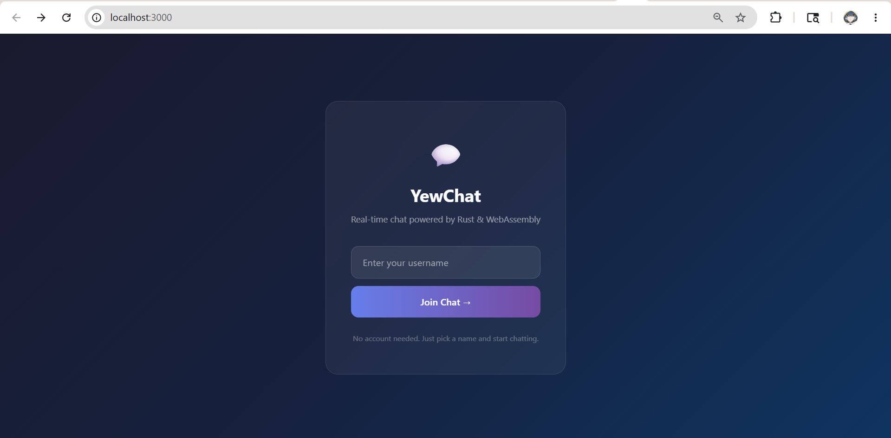
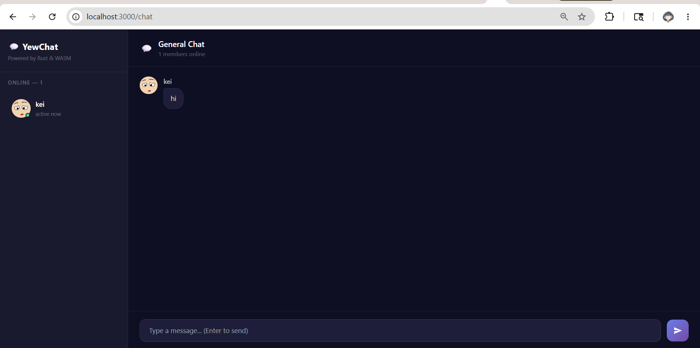

# YewChat 💬

> Source code for [Let’s Build a Websocket Chat Project With Rust and Yew 0.19 🦀](https://fsjohnny.medium.com/lets-build-a-websockets-project-with-rust-and-yew-0-19-60720367399f)

## Install

1. Install the required toolchain dependencies:
   ```npm i```

2. Follow the YewChat post!

## Branches

This repository is divided to branches that correspond to the blog post sections:

* main - The starter code.
* routing - The code at the end of the Routing section.
* components-part1 - The code at the end of the Components-Phase 1 section.
* websockets - The code at the end of the Hello Websockets! section.
* components-part2 - The code at the end of the Components-Phase 2 section.
* websockets-part2 - The code at the end of the WebSockets-Phase 2 section.

## Experiment 3.1: Original Code

### Screenshot


The application consists of two parts: a JavaScript WebSocket server and a Rust/Yew frontend client compiled to WebAssembly. When a user opens the app, they enter their username on the login page and click "Go Chatting!" to enter the chat room. Messages typed by any user are sent to the WebSocket server, which broadcasts them to all connected clients in real time. Each user is displayed in the Users panel on the left side with their avatar and name.

## Experiment 3.2: Be Creative!

### Screenshot



### What I changed

**1. New dark theme UI**
Replaced the plain gray UI with a dark navy theme using gradient backgrounds.
The login page now has a glassmorphism-style card with a gradient background.

**2. Redesigned login page**
Added a app title, subtitle ("Real-time chat powered by Rust & WebAssembly"),
and a small note at the bottom ("No account needed. Just pick a name and 
start chatting.").

**3. Improved user sidebar**
The sidebar now shows an online indicator (green dot) next to each user's 
avatar and displays "active now" under their name. It also shows the total 
number of online users at the top.

**4. Better chat area**
Messages now have a cleaner bubble design with rounded corners. An empty 
state message ("No messages yet. Say hello! 👋") is shown when there are.

**5. Send message with Enter key**
Added keyboard shortcut, pressing Enter now sends the message, so users 
don't have to click the send button every time.